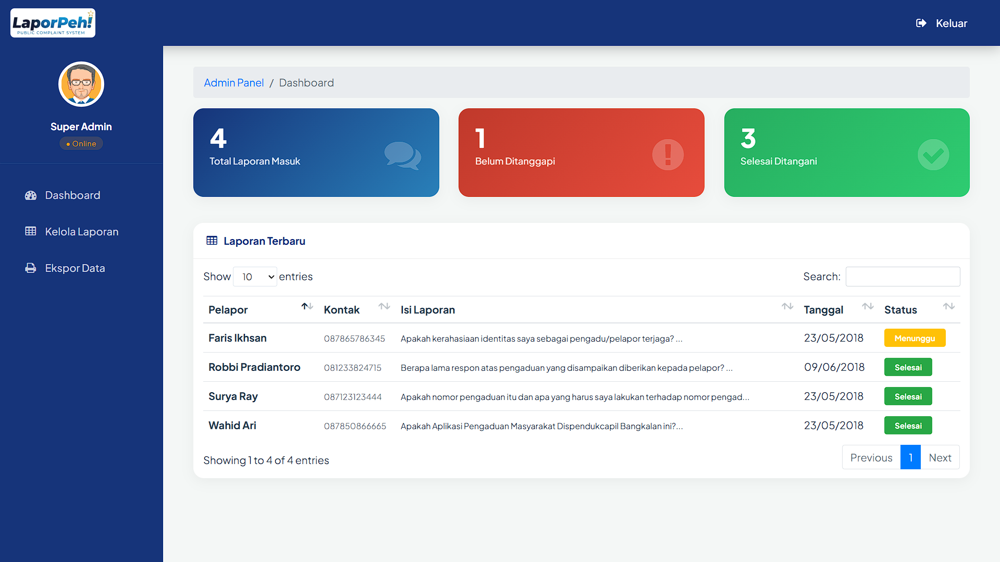

# 📢 LaporPeh! - Layanan Aspirasi Wong Kito


**LaporPeh!** adalah sebuah platform layanan aspirasi dan pengaduan masyarakat berbasis web yang modern, responsif, dan transparan. Aplikasi ini dirancang untuk menjembatani komunikasi antara warga Kota Palembang dengan pemerintah setempat, memungkinkan pelaporan masalah publik (seperti infrastruktur, administrasi, keamanan) secara cepat dan pemantauan status tindak lanjut secara _real-time_.

> _"Suara Anda, Perubahan Untuk Kita Semua."_

---

## 🚀 Fitur Utama

### 🌍 Sisi Pengguna (Public)

- **Landing Page Modern:** Tampilan beranda yang bersih dengan _hero section_ menarik, statistik laporan _real-time_, dan _feed_ aspirasi terkini.
- **Formulir Pengaduan:** Antarmuka pelaporan yang mudah digunakan dengan validasi data, kategori laporan, dan keamanan Captcha.
- **Sistem Tiket & Pelacakan:** Setiap laporan mendapatkan Nomor Tiket unik. Warga dapat memantau progres laporan (Menunggu/Selesai) dan melihat tanggapan petugas secara transparan.
- **Privasi Terjaga:** Opsi pelaporan yang aman dengan perlindungan data pribadi.
- **Desain Responsif:** Tampilan optimal di berbagai perangkat (Desktop, Tablet, Smartphone) menggunakan **Bootstrap 5**.

### 🛡️ Sisi Admin (Dashboard)

- **Autentikasi Aman:** Halaman login eksklusif dengan desain _Split Screen_ modern.
- **Dashboard Statistik:** Ringkasan visual jumlah laporan masuk, menunggu verifikasi, dan selesai ditangani.
- **Manajemen Laporan:** Tabel data interaktif (DataTables) dengan fitur pencarian dan penyortiran.
  - 👁️ **Lihat Detail:** Membaca laporan lengkap.
  - 💬 **Balas/Tindak Lanjut:** Memberikan respons resmi kepada pelapor.
  - 🗑️ **Hapus:** Menghapus laporan yang tidak valid atau spam.
- **Ekspor Data:** Fitur unduh rekap laporan ke format **Excel**, **PDF**, atau **Cetak (Print)** untuk kebutuhan arsip dinas.

---

## 🛠️ Teknologi yang Digunakan

Aplikasi ini dibangun dengan teknologi web standar yang handal dan mudah dikembangkan:

**Backend:**

- **PHP Native (7.4+)**: Logika pemrosesan data yang cepat dan efisien.
- **MySQL / MariaDB**: Penyimpanan basis data relasional yang stabil.
- **PDO (PHP Data Objects)**: Koneksi database yang aman (mencegah SQL Injection).

**Frontend:**

- **HTML5 & CSS3**: Struktur dan gaya dasar.
- **Bootstrap 5 (User)**: Framework UI modern untuk tampilan publik.
- **Bootstrap 4 + SB Admin 2 (Admin)**: Framework UI robust untuk panel dashboard.
- **Google Fonts**: Menggunakan font _Plus Jakarta Sans_ untuk tipografi modern.
- **FontAwesome 6**: Ikon vektor berkualitas tinggi.
- **Animate.css**: Animasi halus pada elemen antarmuka.

**Plugins & Libraries:**

- **jQuery**: Manipulasi DOM dan event handling.
- **DataTables**: Tabel canggih dengan fitur _search_, _pagination_, dan _export_.
- **PHP GD Library**: Digunakan untuk _Captcha generator_.

---

## 📸 Tangkapan Layar (Screenshots)

|                  Halaman Utama                  |                   Halaman Lapor                   |
| :---------------------------------------------: | :-----------------------------------------------: |
|  |  |

|                      Cek Status                      |                  Admin Dashboard                  |
| :--------------------------------------------------: | :-----------------------------------------------: |
|  |  |

---

## ⚙️ Cara Instalasi

Ikuti langkah-langkah berikut untuk menjalankan proyek ini di komputer lokal Anda (XAMPP/WAMP/MAMP):

1.  **Clone atau Unduh:**
    Unduh source code proyek ini dan ekstrak ke dalam folder server lokal Anda (misalnya: `C:\xampp\htdocs\laporpeh`).

2.  **Persiapan Database:**

    - Buka **phpMyAdmin** (`http://localhost/phpmyadmin`).
    - Buat database baru dengan nama `kp` (atau sesuaikan dengan konfigurasi).
    - Impor file `database/kp.sql` ke dalam database yang baru dibuat.

3.  **Konfigurasi Koneksi:**

    - Buka file `private/database.php` dan `admin/database.php`.
    - Sesuaikan pengaturan database jika perlu:
      ```php
      $db_host = "localhost";
      $db_user = "root";
      $db_pass = "";
      $db_name = "kp";
      ```

4.  **Jalankan Aplikasi:**
    - Buka browser dan akses: `http://localhost/laporpeh`
    - Untuk akses admin: `http://localhost/laporpeh/admin`
    - **Akun Admin Default:**
      - Username: `admin`
      - Password: `admin` (atau cek di tabel `admin` database, password terenkripsi SHA-256).

---

## 📂 Struktur Folder

```text
laporpeh/
├── admin/              # Panel Administrator
│   ├── css/            # Styling khusus admin
│   ├── js/             # Script admin & chart
│   ├── vendor/         # Library (Bootstrap, DataTables)
│   ├── index.php       # Dashboard
│   ├── login.php       # Halaman Login
│   └── tables.php      # Manajemen Data
├── css/                # Styling Halaman Publik (Bootstrap 5 custom)
├── images/             # Aset Gambar (Logo, Avatar, Banner)
├── js/                 # Script interaktif frontend
├── private/            # Logika Backend (Koneksi, Validasi, Captcha)
├── database/           # File Dump SQL
├── index.php           # Landing Page
├── lapor.php           # Halaman Form Pengaduan
├── lihat.php           # Halaman Cek Status Laporan
└── README.md           # Dokumentasi Proyek
```