# 📢 LaporPeh! - Sistem Pengaduan Masyarakat


**LaporPeh!** adalah platform layanan aspirasi dan pengaduan masyarakat modern yang dirancang khusus untuk menjembatani komunikasi antara warga Kota Palembang dengan pemerintah setempat.

Dibangun dengan pendekatan _User-Centric_, aplikasi ini menawarkan antarmuka yang bersih, responsif, dan transparan, memungkinkan masyarakat untuk melaporkan permasalahan kota (seperti infrastruktur rusak, masalah administrasi, atau keamanan) dan memantau tindak lanjutnya secara _real-time_.

> _"Suara Anda, Perubahan Untuk Kita Semua."_

---

## 🌟 Fitur Unggulan

### 🌍 Sisi Pengguna (Public)

Fitur yang dapat diakses oleh masyarakat umum tanpa perlu login:

- **Hero Section Modern:** Tampilan beranda yang ramah dengan akses cepat (CTA) ke fitur utama.
- **Formulir Pengaduan Cerdas:** Input laporan yang mudah dengan validasi data otomatis, pemilihan kategori, dan keamanan **Captcha** untuk mencegah spam.
- **Tracking Sistem (Cek Resi):** Warga dapat memantau status laporan mereka cukup dengan memasukkan **Nomor Tiket Unik**.
- **Transparansi Proses:** Menampilkan riwayat status laporan (Menunggu Verifikasi → Proses → Selesai) beserta tanggapan resmi dari petugas.
- **Privasi & Keamanan:** Identitas pelapor dijaga kerahasiaannya (opsi laporan anonim tersedia secara sistem).
- **Desain Responsif:** Tampilan optimal di semua perangkat (Desktop, Tablet, dan Smartphone).

### 🛡️ Sisi Administrator (Panel Admin)

Panel kontrol eksklusif untuk petugas/admin:

- **Secure Login System:** Halaman login dengan enkripsi password **SHA-256** dan desain _Split Screen_ modern.
- **Dashboard Statistik:** Ringkasan visual data laporan (Masuk, Menunggu, Selesai) dalam bentuk kartu statistik yang informatif.
- **Manajemen Laporan Terpusat:**
  - **Tabel Interaktif (DataTables):** Fitur pencarian instan, pengurutan data, dan _pagination_.
  - **Quick Actions:** Tombol aksi cepat untuk melihat Detail, Membalas, atau Menghapus laporan.
- **Detail & Tindak Lanjut:**
  - Melihat isi laporan secara mendalam menggunakan **Modal Pop-up** (tanpa reload halaman).
  - Memberikan tanggapan resmi yang langsung terkirim ke sisi pengguna.
  - **Auto-Update Status:** Status laporan otomatis berubah menjadi "Selesai" begitu admin memberikan tanggapan.
- **Laporan & Arsip (Export):** Fitur unduh rekap data ke format **Excel**, **PDF**, atau **Print** langsung untuk kebutuhan laporan dinas.

---

## 📸 Galeri Tampilan

Berikut adalah cuplikan antarmuka aplikasi LaporPeh!:

## 🧑‍💻 Tampilan Pengguna (Public)

Antarmuka yang bersih, responsif, dan mudah digunakan oleh siapa saja.

### Halaman Utama & Formulir Lapor

| Halaman Utama (Home) | Formulir Lapor |
| :------------------: | :------------: |
| 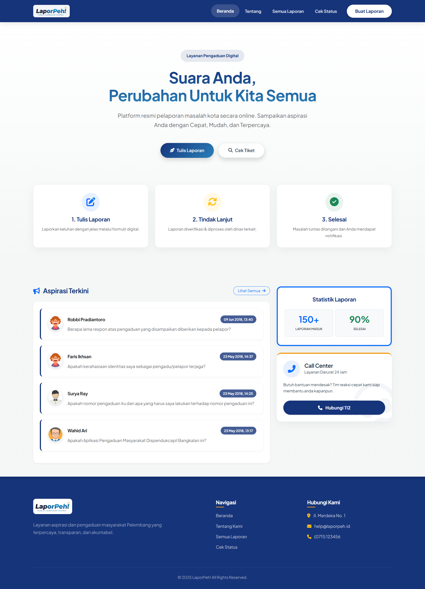<br>_Hero section dengan navigasi yang intuitif._ | 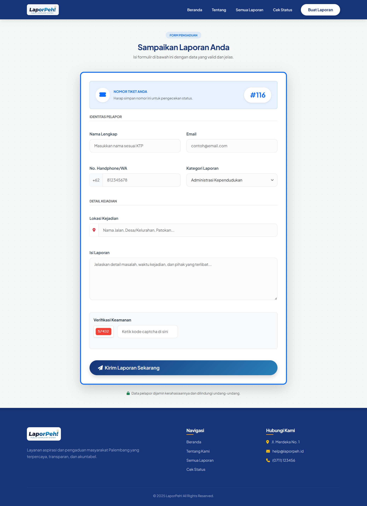<br>_Formulir pengaduan yang rapi dan tervalidasi._ |

### Tracking & Hasil Penelusuran

| Cek Status Tiket | Hasil Penelusuran |
| :--------------: | :---------------: |
| 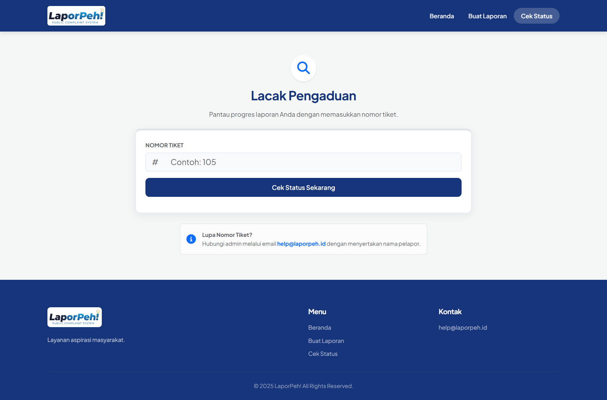<br>_Halaman pelacakan status laporan._ | 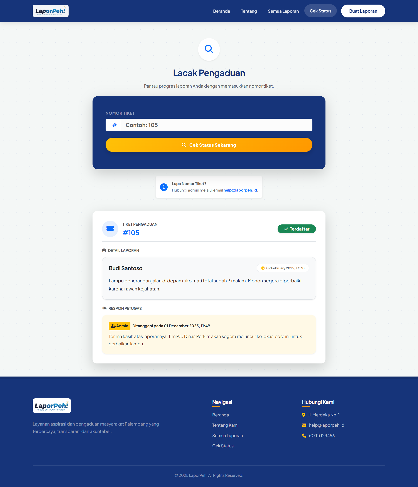<br>_Informasi status laporan dan balasan petugas._ |

### Feed & Tentang

| Feed Laporan Publik | Tentang Aplikasi |
| :-----------------: | :--------------: |
| 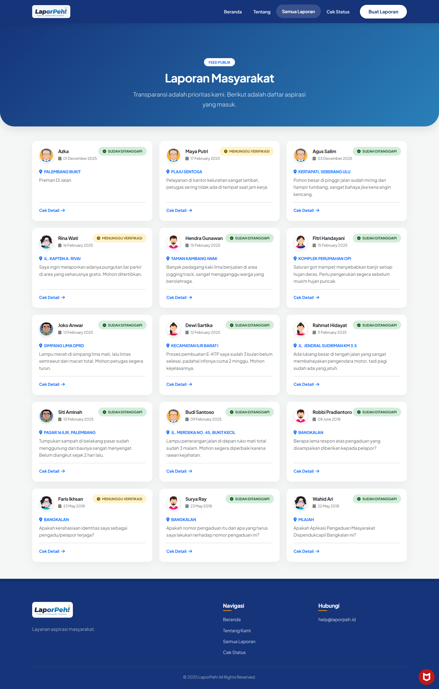<br>_Menampilkan daftar laporan publik secara ringkas dan informatif._ | 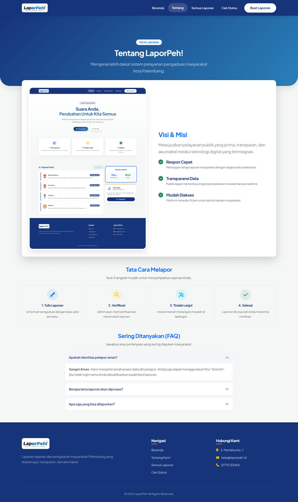<br>_Informasi mengenai tujuan, fungsi, dan manfaat aplikasi._ |

---

## 🛠️ Panel Administrator

Panel admin dirancang dengan tampilan profesional untuk mendukung efisiensi kerja petugas.

### Login & Dashboard

| Login Administrator | Dashboard Utama |
| :-----------------: | :-------------: |
| 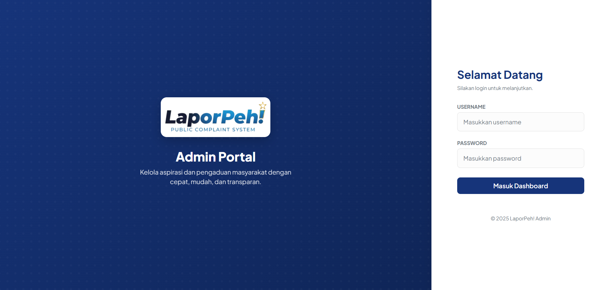<br>_Tampilan login dengan visual branding._ | 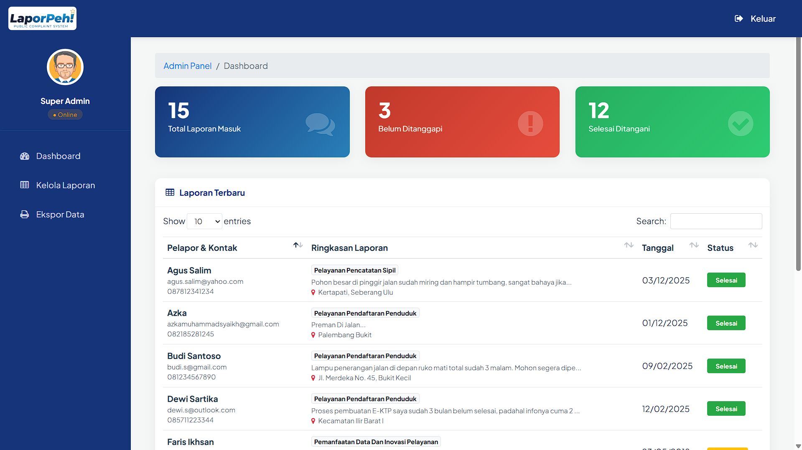<br>_Statistik laporan masuk secara real-time._ |

### Manajemen & Ekspor Data

| Manajemen Data | Ekspor Laporan |
| :------------: | :------------: |
| 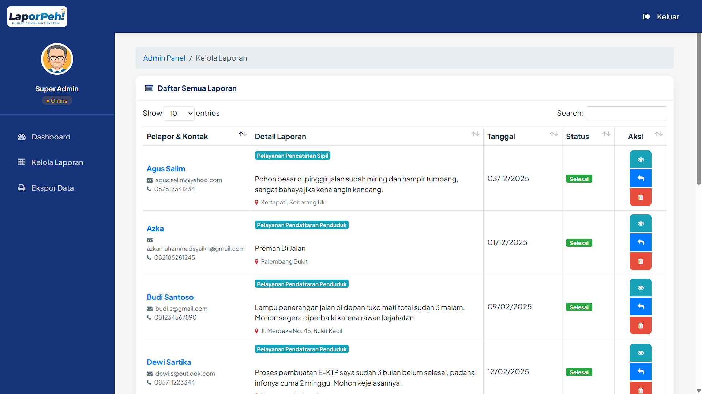<br>_Pengelolaan data laporan dalam bentuk tabel dengan aksi cepat._ | 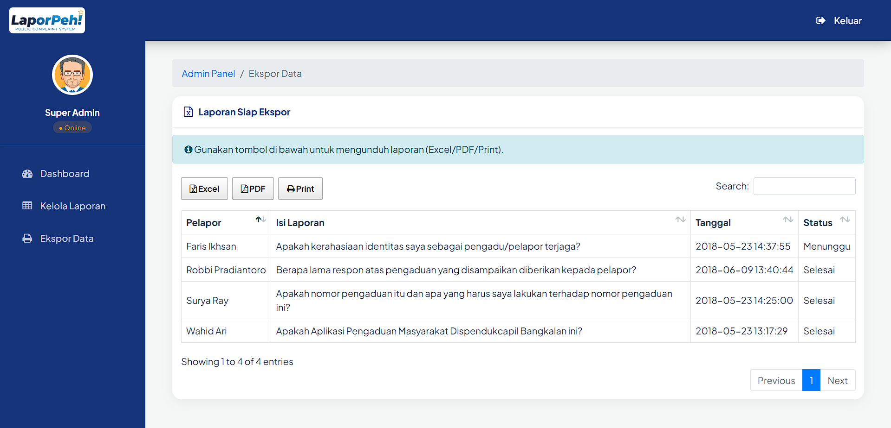<br>_Fitur ekspor laporan ke Excel atau PDF._ |

### Detail & Balas Laporan

| Detail Laporan | Balas Laporan |
| :------------: | :-----------: |
| 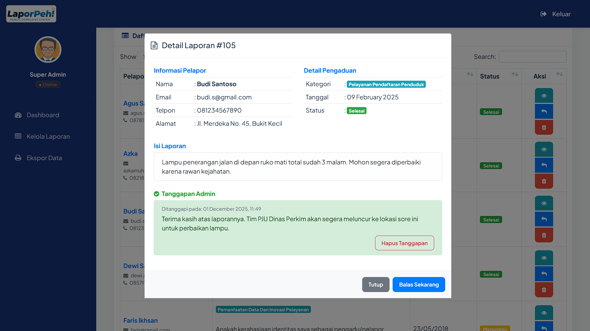<br>_Menampilkan informasi lengkap laporan, termasuk data pelapor, kategori, status, dan riwayat tindak lanjut._ | 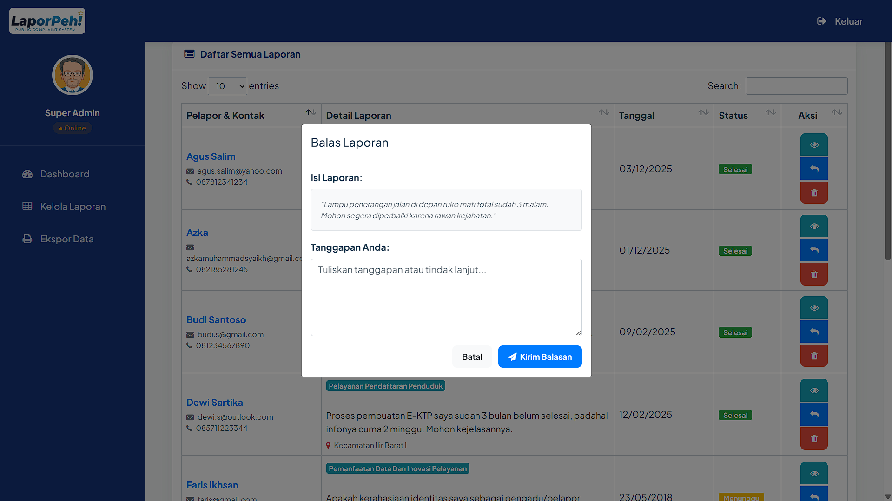<br>_Petugas dapat memberikan balasan atau tindak lanjut resmi terhadap laporan yang masuk._ |

---

## 🛠️ Teknologi & Stack

Aplikasi ini dibangun menggunakan teknologi web standar yang handal (_Robust & Scalable_):

- **Bahasa Pemrograman:** PHP Native (Versi 7.4 / 8.0+)
- **Basis Data:** MySQL / MariaDB
- **Konektivitas Database:** PHP Data Objects (PDO) - _Lebih aman dari SQL Injection._
- **Frontend Framework:**
  - **Bootstrap 5** (User Interface)
  - **Bootstrap 4** (Admin Interface)
- **Font & Tipografi:** Plus Jakarta Sans (Google Fonts)
- **Library Pendukung:**
  - **DataTables:** Untuk tabel interaktif canggih.
  - **jQuery:** Untuk interaksi dinamis dan AJAX.
  - **FontAwesome 6:** Ikon vektor modern.
  - **Animate.css:** Animasi transisi elemen UI.
  - **PHP GD Library:** Generator kode Captcha.

---

## ⚙️ Panduan Instalasi (Localhost)

Ikuti langkah ini untuk menjalankan proyek di komputer Anda:

1.  **Persiapan Lingkungan:**
    Pastikan Anda telah menginstal Web Server lokal seperti **XAMPP**, **WAMP**, atau **MAMP**.

2.  **Setup Database:**

    - Buka **phpMyAdmin** (`http://localhost/phpmyadmin`).
    - Buat database baru dengan nama: `kp` (sesuai konfigurasi default).
    - Pilih database `kp`, lalu masuk ke tab **Import**.
    - Pilih file `database/kp.sql` dari folder proyek ini dan klik **Go/Kirim**.

3.  **Konfigurasi Proyek:**

    - Salin folder proyek `laporpeh` ke dalam direktori `htdocs` (XAMPP) atau `www` (WAMP).
    - (Opsional) Jika nama database atau password berbeda, sesuaikan file koneksi:
      - `private/database.php`
      - `admin/database.php`

4.  **Menjalankan Aplikasi:**

    - **Akses User:** Buka browser dan ketik `http://localhost/Sistem-Pengaduan-Masyarakat`
    - **Akses Admin:** Buka browser dan ketik `http://localhost/Sistem-Pengaduan-Masyarakat/admin`

5.  **Akun Administrator Default:**
    Gunakan kredensial berikut untuk masuk ke panel admin:
    - **Username:** `admin`
    - **Password:** `admin`
      _(Catatan: Password disimpan dalam database menggunakan enkripsi SHA-256)_

---

## 📂 Struktur Direktori

```text
Sistem-Pengaduan-Masyarakat/
├── admin/                  # MODUL ADMINISTRATOR
│   ├── css/                # Stylesheet khusus admin
│   ├── js/                 # Script interaktif admin
│   ├── images/             # Aset gambar admin
│   ├── vendor/             # Dependensi (Bootstrap, DataTables, FontAwesome)
│   ├── index.php           # Dashboard Utama
│   ├── login.php           # Halaman Login
│   ├── tables.php          # Manajemen Laporan
│   ├── export.php          # Halaman Ekspor Data
│   ├── auth.php            # Middleware sesi login
│   ├── logout.php          # Script logout
│   └── database.php        # Koneksi DB Admin
│
├── css/                    # MODUL PENGGUNA (PUBLIC)
│   ├── style.css           # Styling utama antarmuka user
│   └── ...
├── images/                 # Aset Gambar Utama (Logo, Banner, Avatar)
├── js/                     # Script frontend user
├── private/                # Logika Backend
│   ├── captcha.php         # Generator gambar captcha
│   ├── validasi.php        # Proses validasi formulir
│   └── database.php        # Koneksi DB User
├── database/               # Backup Database SQL
├── index.php               # Halaman Utama (Landing Page)
├── lapor.php               # Halaman Form Pengaduan
├── lihat.php               # Halaman Cek & Tracking Tiket
└── README.md               # Dokumentasi Proyek
```
